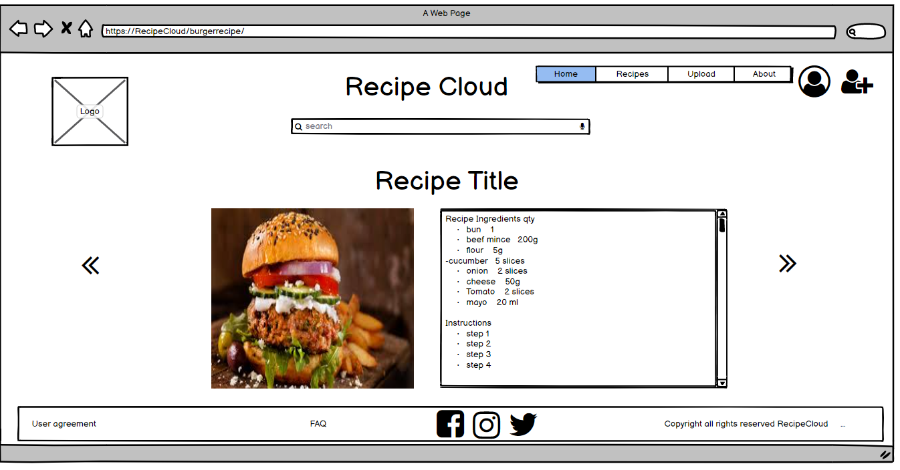
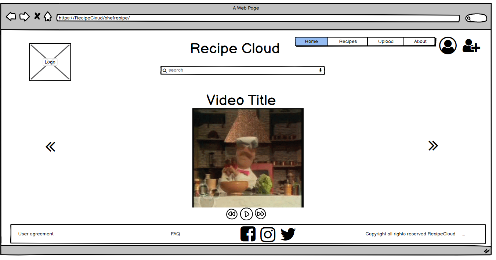
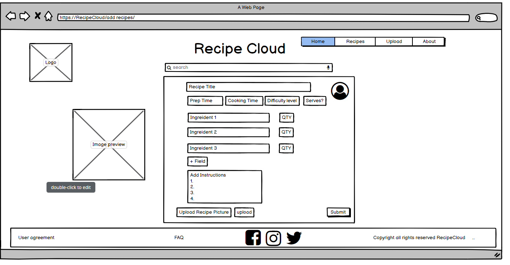
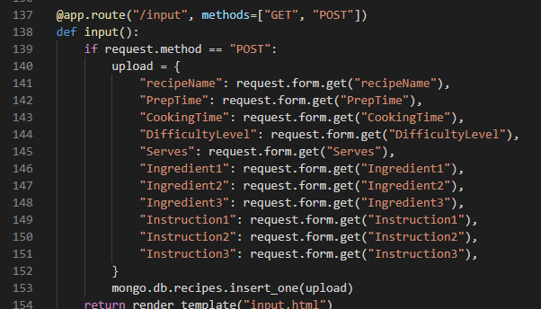
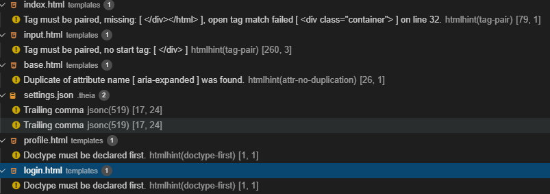

# Recipe Cloud #

## Contents ##
---

* [UX](#User-Experience)
    * [Project Goals](#project-goals)
    * [User Goals](#user-goals)
    * [User Stories](#user-stories)
    * [User Requirements and Expectations](#requirements)
    * [Design Choices](#design-choices)
        * [Fonts](#fonts)
        * [Icons](#icons)
        * [Colors](#colors)
* [Wireframing](#wireframing)
* [Features](#features)
    * [Features that have been developed](#developed)
    * [Features that will be implemented in the future](#implemented)
* [Technologies](#technologies)
* [Testing](#testing)
* [Issues](#issues)
* [Deployment](#deployment)
* [Credit](#credits)

## UX (User Experience) ##
---

### Project Goals ###

The are many places on the internet to find recipes but their are not many that allow you to add your own recipes to swap and share 

The **goal** for this project is to to recreate a neighbourhood profile where friends,  neighbours and relatives can swap and share their favourite recipes, simply and easily.
A safe space to find inspiration with the items already in theor fridge.

### User Goals ###

For the UX on this project I wanted to create a simple and user friendly site. My target audience is young and mature adults.  
The site also allows for Profeesional Chefs to share some of thier awards winning recipes but also for the student to swap their  
quick fixes even grandmas can leave their family recipes down for everyone to enjoy!!

* **Testing his/her/their Cooking abilites** with **quick searches** within the **Category** they are looking for.
* **Being excited** to find new recipes and **share** their own.
* Get a **inspiration** for cooking out of the box.
* **Keep adding more and more recipes** to the website **again & again**.
* **List their own Recipes** and **favourite** recipes to go to **time and again**

### User Stories ### 

* The **user** wants an **attractive website** with a **non-distracting** background.
* The **user** wants to see **clear instructions** on how to add recipes to the website.
* The **user** wants there to be a **search box** so that the user can quickly identify **recipes**.
* The **user** wants to be able to **search** categories or ingredients.
* The **user** wants to be **challenged** in his/her/their **skills**.
* The **user** wants to know the **difficulty** of the recipe before **deciding**.
* The **user** wants to start **finding recipes immedaitely**. 
* The **user** wants to see the **latest recipes** added.
* The **user** wants a **conveint sized recipes box** to be able to read the recipe clearfully.
* The **user** wants to know the **recipe** details such as **ingredients, method and cooking instructions**
* The **user** wants to **have the possibility** of thier **own profile** where their recipes come up first.
* The **user** wants to **have the possibility** of **favorites** where their best recipes are **saved for later**.
* The **user** wants to **know** if **their recipe has been submitted**.
* The **user** wants to **easily add their own recipe** to the website.
* The **user** wants to **have the possibility** to **upload pictures or videos**.
* The **user** wants to get a maximum of advantage of the **recipe cloud**.

### Research ###

* When developing this **website**, I kept in mind that the aesthetic should be inspired by similar Recipe hubs on the internet. 
* I tried to create a **simple and easy feel** to for a cleaner approach for the landing page.
* I checked **previously made recipe websites** such as [**foodnetwork.co.uk**](https://foodnetwork.co.uk/) and used **my own experience** as a trained chef.

### Design Choices ###
---

### Fonts ###

* The **landing page** is using the classic website **Google Fonts** **#** for the H1 and H3. 
* I paired it with the **Google Fonts** **#** for readability.
* I kept the **#** font for **better user experience**

### Icons and Images ###

* The **Favicon** used on the website are provided by [**ICOconvert**](https://icoconvert.com/)
* The **image** used for the **landing page** is a created **image** from the image bank [**Canva**](https://canva.com/). 
* Extra **background images** (https://google.com/) with a simple research with the keyword **cooking and baking**.

### Colors ###

* The **color scheme** used for the website is a sleek **recipe website palette** composed of a combination of **black and whites** for the **title** and a **classic light teal** for calming affect for the **logo** on the **a sky blue with neon type writing** .
 

## Wireframing ##
---
For **wireframing** I used the tool [**Balsamiq**](https://balsamiq.com/).

Please follow the link to find the preview [here] 

href = https://balsamiq.cloud/srsmfvs/pt96bgn/r7C4D

* Herewith the **wireframe** and I pushed a few changes for better readability and engagement:
* I added **a jumbotron hero image** on the landing page.
* I added **a full-screen background image** on all the other pages.
* I used a **form** to allow for the user to add recipes.
* I added an easy link to **upload** videos.

### Landing Page ###

### Recipe Menu ###

### Video Page ###

### Add User Page ###

### Add Recipe Page ###

## Features ## 
---

### Implemented Features ###

* **Responsiveness** on all screen sizes.
* **large title** for attractiveness and engagement.
* **Suggested recipes** on landing page as an introduction.
* **User login/logout** so that users can keep a tally of their own recipes added and videos uploaded.
* **Favorites** for user to quickly reference recipes they enjoyed or still want to Experiment with.
* **Input Recipes** to the website.
* **Search Recipes** on the Website.
* **Instructions** so that the user can grasp the concept immedaitely.
* **Immedaite** recipes with Easy and simple instructions to make the recipe.
* **Download success** notation when recipe has successfully saved to the database
* **upload picture** with the recipe to give people a sense of what can be acheived with their recipe.
* **upload video** allows users to upload videos of themselves creating a recipe.

### Future implemented features ###

* **Feature 1** - Rating system for others to be able to rate the recipe success.
* **Feature 2** - Comment box and messages notifications for users to interact with each other.
* **Feature 3** - 

## Technologies used ##

* [HTML](https://developer.mozilla.org/en-US/docs/Web/HTML)
* [CSS](https://developer.mozilla.org/en-US/docs/Web/CSS)
* [Javascript](www.javascript.com)
* [JQuery](https://jquery.com/)
* [Python](https://www.python.org/)

**Tools & Libraries**

* [Bootstrap](https://getbootstrap.com/)
* [Font-Awesome](https://fontawesome.com/icons?d=gallery)
* [Google fonts](https://fonts.google.com/)
* [Git](https://git-scm.com/)
* [PNGtree](https://PNGtree.com/)
* [Flask](https://pypi.org/project/Flask/)
* [Canva](https://canva.com)
* [MongoDB](https://cloud.mongodb.com/)

## Testing ##
---

* I tested the responsiveness of the website by using the [**Google Chrome Developer Tool**](https://developers.google.com/web/tools/chrome-devtools) as well as the plug-in **Unicorn Revealer** to control my overflow and the website [**Am I Responsive**](http://ami.responsivedesign.is/). 
* I also tested my website on **different browsers and real devices** : **Iphone 6s, Ipad Pro 12", Ipad Mini, Google Chrome, Safari, Mozilla Firefox and Samsung A70.**
* I used a first **dirty version** of this project on **Gitpod** and **refactored** my code **step by step** to remove any **useless classes**
* I tested my CSS file and my HTML files using [**CSS Validator**](https://jigsaw.w3.org/css-validator/) and [**HTML Validator**](https://validator.w3.org/).
* I tested every **functions** of my script.js using multiple **console.log** and checking for **errors** in the **Google Chrome console**.
* All pages passed the HTML,CSS and Python validator final test with no major issues.

**Responsiveness**

* **Implementation** 

* I used **Bootstrap** as well as **flexbox and custom CSS media queries** to ensure that the website didn't break on all screen sizes.

**Landing Page**

* **Implementation** 

**Add recipes**

 

* **Implementation**

**Profile**

 

* **Implementation**

**Recipes links**

 

* **Implementation**

## Issues ##
---

**During development**

* I had a major issue with my MongoDB file whilst setting up the database because of this issue: 

**Issues**

I did not understand what was going on as my form was good and allowing me to add into the fields, however when I submitted it was not sending it to the  
database and saving it in the collections?

To understand the error I went thorugh the code again and fixed it by ********

I also has few errors passing through my GitPod, basic house cleaning fixed most of the issues very quickly

After I put my project up for peer-review, it was brought to my attention that the website needed ***********

After my mentor call and my peer-code-review I realized that I needed to add some ********************

## Deployment ##
---
**RecipeCloud** was developed on **GitPod**, using **GitHub** to host the repository and deployed on **GitHub Pages**.
**Heroku** made the deployment extremely painless:

* Connect to [**Heroku**](https://dashboard.heroku.com/apps)
* Click new/ **create new APP**
* Add the new app name and choose a region, In my case **Europe**
* While the app is being generated you will need to **Config Vars** by going to **settings**
* Config vars change the way your app behaves. In addition to creating your own, some add-ons come with their own
* In **Config vars** you need to add the **ID,PORT,MONGODB_NAME,MONGO_URI,SECRET_KEY**
* Now to **Deploy** find deployment method choose **GitHub** sign into your GitHub.
* Selected the repository **JustWhittaker/PRO3-RecipeCloud**
* In the **GitHub Pages** I selected **Master Branch** and **/root** in the dropdown menu and clicked **Save**
* Click on **"Automatic Deploys"** below 
* I waited 2 minutes.
* **The website is now live on https://recipe-cloud-pro.herokuapp.com/**.

**Cloning** No issues:

* Why do we is it important to be able to clone successfully first **Collaboration** with team members if you are working in a scrum and secondly **Assist** other developers to use my main project to grow their own version.
* In my repository **JustWhittaker/PRO3-RecipeCloud**, click on the **"Code** green button, **copy in clipboard the HTTPS link**, open your **IDE** and look through my files.
* The link : **https://github.com/JustWhittaker/PRO3-RecipeCloud.git**

## Credits ##
---

**Text Credits:**

* All text content has been written by Justin Whittaker.

I received inspiration and technical knowledge for this project from the following platforms
1. Bootstrap  
https://mdbootstrap.com/docs/standard/forms/input-fields/ 
https://getbootstrap.com/docs/4.3/components/card/ 
https://getbootstrap.com/docs/4.3/components/dropdowns/ 
https://www.w3schools.com/bootstrap/bootstrap_ref_css_images.asp

2. MongoDB  
https://cloud.mongodb.com/  
https://towardsdatascience.com/using-mongodb-with-python-bcb26bf25d5d#9c71 
https://www.w3schools.com/python/python_mongodb_query.asp 
https://docs.mongodb.com/manual/reference/bson-types/ 
https://towardsdatascience.com/using-mongodb-with-python-bcb26bf25d5d#9c71 
https://www.w3schools.com/python/gloss_python_date.asp 

3. Python research  
    1. CodeInstitute Python Funadementals  
    2. https://randomkeygen.com/  

4. Better Git Commit terms  
http://karma-runner.github.io/5.0/dev/git-commit-msg.html

5. Dependencies  
    1. PyMongo  
    2. JQuery (html js middleware)  
    The project uses JQuery to simplify DOM manipulation.  
    3. bootstrap  
    4. dnspython

**Many thanks to:**

* My mentor **Ignatius Ukwuoma** for his patience and kindness
* **AudreyLL88** for her very inspiring ReadME
* **Code Institute Slack community** for the technical and emotional support
* **Carl Lubbe**, for all the assistance and help with guidence and UX
* **Alishia Whittaker**, for the Graphic design and stock images from Canva and your support through all my studies

**Site for educational purposes only!**